# Devops project

## Global architecture diagram


## Use case diagram


## Sequence diagrams

- We are mentioning only the sequence diagrams of commands.

### Create command (CLIENT)


### List commands of a client (CLIENT)


### List all commands (ADMIN)


## Dockerization

- To dockerize the microservices discovery-service, gateway-service, product-service and command-service:
  - we generate a jar file with `mvn package`.
  - Then we create a Dockerfile for each service to build image for each service from the jdk image.
```
FROM mosipdev/openjdk-21-jdk

LABEL authors="mouad"

VOLUME /temp

RUN apt-get update && apt-get install -y curl

COPY target/*.jar app.jar

ENTRYPOINT ["java", "-jar", "/app.jar"]
```
- example of a service in docker compose file (gateway service)
```yml
gateway-service:
  build: ./gateway-service
  container_name: gateway-service
  ports:
    - "8888:8888"
  expose:
    - "8888"
  environment:
    DISCOVERY_SERVICE_URL: http://discovery-service:8761/eureka
    JWK_URI: http://keycloak:8080/realms/devsecops-realm/protocol/openid-connect/certs
```

- Second we dockerize the front end by using node js and nginx image and some npm commands.
- And it was important here to create build variables that will be passed as args in docker compose.
```
# ---------- build stage ----------
FROM node:20-alpine AS build

WORKDIR /app

COPY package*.json ./
RUN npm install

COPY . .

ARG VITE_KEYCLOAK_URL
ENV VITE_KEYCLOAK_URL=$VITE_KEYCLOAK_URL

ARG VITE_API_URL
ENV VITE_API_URL=$VITE_API_URL

RUN npm run build


# ---------- runtime stage ----------
FROM nginx:alpine

# Remove default nginx config
RUN rm /etc/nginx/conf.d/default.conf

# Copy custom nginx config
COPY nginx.conf /etc/nginx/conf.d/default.conf

# Copy React build
COPY --from=build /app/dist /usr/share/nginx/html

EXPOSE 80

CMD ["nginx", "-g", "daemon off;"]
```
- a part of the front-end container in docker compose file
```yml
front-end:
  build:
    context: ./front-end
    args:
      VITE_KEYCLOAK_URL: http://localhost:8080
      VITE_API_URL: http://localhost:8888
  container_name: front-end
```

## Functionalities screenshots

- First we have **list products** and **see product details** which is accessible by CLIENT and ADMIN
- Second we have **add**, **modify** and **delete** product accessible only by the ADMIN

#### CLIENT
- list products


- see product details


#### ADMIN
- list, add, edit and delete product


- Then the ADMIN can **list all the commands** (the commands of all clients)
- But the CLIENT can **see his own commands** only and can **create new commands**

#### ADMIN
- list command


#### CLIENT

- list his own commands


- create new command


- Finally we have profile page where we can see the user role and he can logout

#### ADMIN & CLIENT


# Devsecops

## SonarQube

- We run sonarqube in our docker compose file, with some custom volume and a postgres database with its own volume
- Sonarqube container
```yml
  sonarqube:
    image: sonarqube:community
    container_name: sonarqube
    depends_on:
      - postgres-sonar
    ports:
      - "9000:9000"
    environment:
      SONAR_JDBC_URL: jdbc:postgresql://postgres-sonar:5432/sonarqube
      SONAR_JDBC_USERNAME: sonar
      SONAR_JDBC_PASSWORD: sonar
    volumes:
      - sonar_data:/opt/sonarqube/data
      - sonar_extensions:/opt/sonarqube/extensions
    ulimits:
      nofile:
        soft: 65536
        hard: 65536
```
- postgres container
```yml
  postgres-sonar:
    image: postgres:15
    container_name: postgres-sonar
    environment:
      POSTGRES_USER: sonar
      POSTGRES_PASSWORD: sonar
      POSTGRES_DB: sonarqube
    volumes:
      - sonar_pg_data:/var/lib/postgresql/data 
```

### Backend (Microservice)

- First we open sonarqube in `localhost:9000` we login with `admin` `admin` and create projects for each service (discovery, gateway, product and command)
- let's take product service for example
- We create the project

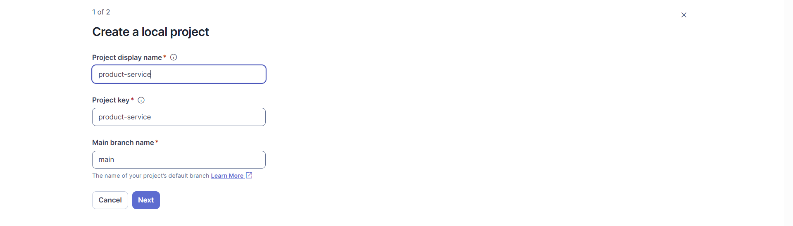

- We can choose some customizations setup code

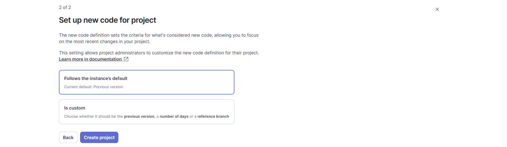

- For the analysis method we chose locally

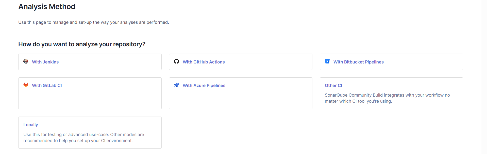

- We generate a token to run sonarqube check later

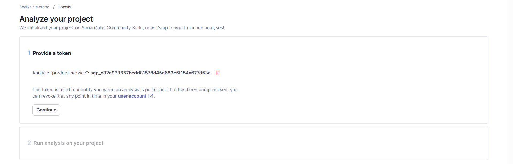

- We get finally the command

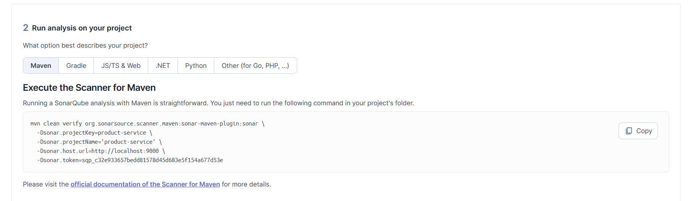

- Then for each service we run the command to start the process

Here the result for all the services :
#### discovery service

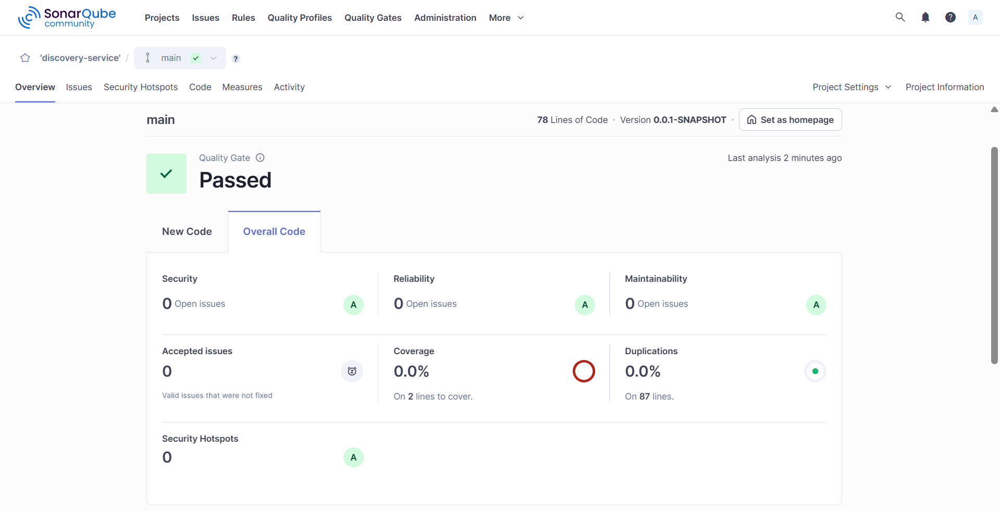

#### gateway service

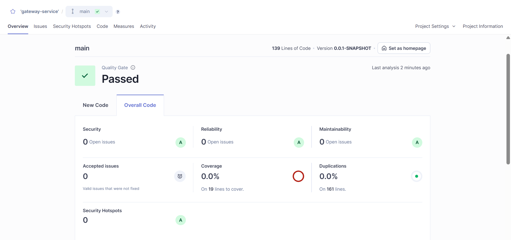

#### product service

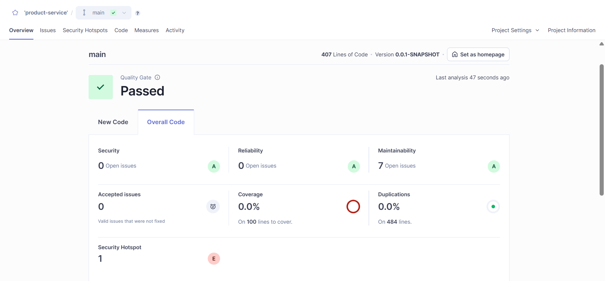

- we can inspect on details the issues with a level (HIGH, MEDIUM, LOW)

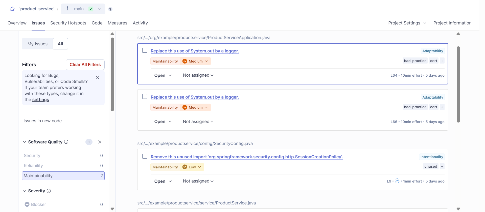

- we can inspect the place of the issue

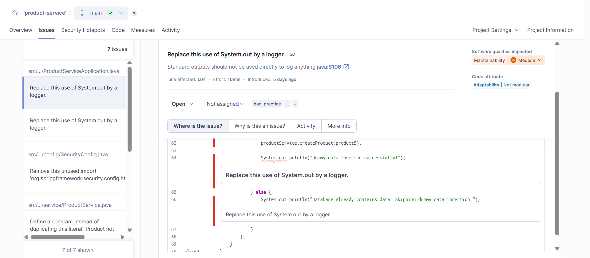

#### command service/


### Frontend

The front end process is different a little bit, here we have to:
- install sonar package with `npm install -g sonarqube-scanner`
- create a file in the frontend directory `sonar-project.properties`
```properties
sonar.projectKey=front-end
sonar.sources=src
sonar.host.url=http://localhost:9000
sonar.login=SONARQUBE_TOKEN
sonar.exclusions=**/node_modules/**
```
- run `sonar-scanner`

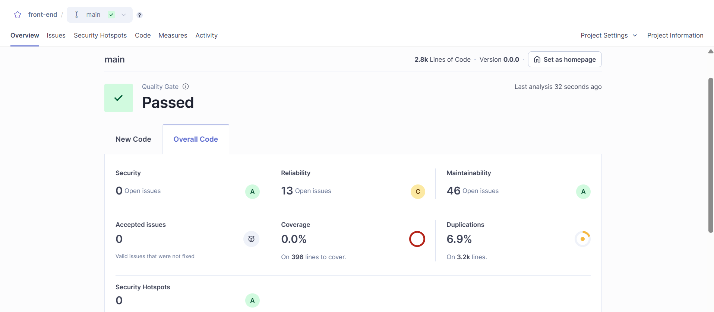

## Trivy (vulnerabilities scanning)

- We build our images with `docker compose build`
- We get the following images names

```
REPOSITORY                                        TAG         IMAGE ID       CREATED          SIZE
devsecops-project-command-service                 latest      0e2d200b4d3d   57 minutes ago   1.3GB
devsecops-project-product-service                 latest      5adbc164beec   57 minutes ago   1.29GB
devsecops-project-gateway-service                 latest      b910f1fdfaad   57 minutes ago   1.26GB
devsecops-project-discovery-service               latest      da6be6fc818f   57 minutes ago   1.24GB
devsecops-project-front-end                       latest      148ea4e3a0aa   25 hours ago     80.2MB
```

- Then we run trivy command to scan for vulnerabilities for each service.
- The following example is of discovery service

```
docker run --rm -v /var/run/docker.sock:/var/run/docker.sock aquasec/trivy image --timeout 15m devsecops-project-discovery-service
```

- and we got as a result

```
25ZINFO    [javadb] Artifact successfully downloaded       repo="mirror.gcr.io/aquasec/trivy-java-db:1"
2026-01-10T18:08:25Z    INFO    [javadb] Java DB is cached for 3 days. If you want to update the database more frequently, "trivy clean --java-db" command clears the DB cache.
2026-01-10T18:08:31Z    INFO    Detected OS     family="ubuntu" version="24.04"
2026-01-10T18:08:31Z    INFO    [ubuntu] Detecting vulnerabilities...   os_version="24.04" pkg_num=253
2026-01-10T18:08:31Z    INFO    Number of language-specific files       num=1
2026-01-10T18:08:31Z    INFO    [jar] Detecting vulnerabilities...
2026-01-10T18:08:31Z    INFO    Table result includes only package filenames. Use '--format json' option to get the full path to the package file.

Report Summary

┌────────────────────────────────────────────────────┬────────┬─────────────────┬─────────┐
│                       Target                       │  Type  │ Vulnerabilities │ Secrets │
├────────────────────────────────────────────────────┼────────┼─────────────────┼─────────┤
│ devsecops-project-discovery-service (ubuntu 24.04) │ ubuntu │       208       │    -    │
├────────────────────────────────────────────────────┼────────┼─────────────────┼─────────┤
│ app.jar                                            │  jar   │        3        │    -    │
└────────────────────────────────────────────────────┴────────┴─────────────────┴─────────┘
Legend:
- '-': Not scanned
- '0': Clean (no security findings detected)


devsecops-project-discovery-service (ubuntu 24.04)
==================================================
Total: 208 (UNKNOWN: 0, LOW: 59, MEDIUM: 147, HIGH: 2, CRITICAL: 0)
```

- and a very long table of the vulnerabilities, but here is a chunk of it

```
┌─────────────────────────┬────────────────┬──────────┬──────────┬─────────────────────────────┬───────────────────────────────┬──────────────────────────────────────────────────────────────┐
│         Library         │ Vulnerability  │ Severity │  Status  │      Installed Version      │         Fixed Version         │                            Title                             │
├─────────────────────────┼────────────────┼──────────┼──────────┼─────────────────────────────┼───────────────────────────────┼──────────────────────────────────────────────────────────────┤
│ coreutils               │ CVE-2016-2781  │ LOW      │ affected │ 9.4-3ubuntu6                │                               │ coreutils: Non-privileged session can escape to the parent   │
│                         │                │          │          │                             │                               │ session in chroot                                            │
│                         │                │          │          │                             │                               │ https://avd.aquasec.com/nvd/cve-2016-2781                    │
├─────────────────────────┼────────────────┤          │          ├─────────────────────────────┼───────────────────────────────┼──────────────────────────────────────────────────────────────┤
│ curl                    │ CVE-2025-0167  │          │          │ 8.5.0-2ubuntu10.6           │                               │ When asked to use a `.netrc` file for credentials **and** to │
│                         │                │          │          │                             │                               │ follow...                                                    │
│                         │                │          │          │                             │                               │ https://avd.aquasec.com/nvd/cve-2025-0167                    │
│                         ├────────────────┤          │          │                             ├───────────────────────────────┼──────────────────────────────────────────────────────────────┤
│                         │ CVE-2025-10148 │          │          │                             │                               │ curl: predictable WebSocket mask                             │
│                         │                │          │          │                             │                               │ https://avd.aquasec.com/nvd/cve-2025-10148                   │
│                         ├────────────────┤          │          │                             ├───────────────────────────────┼──────────────────────────────────────────────────────────────┤
│                         │ CVE-2025-14524 │          │          │                             │                               │ When an OAuth2 bearer token is used for an HTTP(S) transfer, │
│                         │                │          │          │                             │                               │ and...                                                       │
│                         │                │          │          │                             │                               │ https://avd.aquasec.com/nvd/cve-2025-14524                   │
│                         ├────────────────┤          │          │                             ├───────────────────────────────┼──────────────────────────────────────────────────────────────┤
│                         │ CVE-2025-14819 │          │          │                             │                               │ When doing TLS related transfers with reused easy or multi   │
│                         │                │          │          │                             │                               │ handles and...                                               │
│                         │                │          │          │                             │                               │ https://avd.aquasec.com/nvd/cve-2025-14819                   │
│                         ├────────────────┤          │          │                             ├───────────────────────────────┼──────────────────────────────────────────────────────────────┤
│                         │ CVE-2025-15079 │          │          │                             │                               │ When doing SSH-based transfers using either SCP or SFTP, and │
│                         │                │          │          │                             │                               │ setting t...                                                 │
│                         │                │          │          │                             │                               │ https://avd.aquasec.com/nvd/cve-2025-15079                   │
│                         ├────────────────┤          │          │                             ├───────────────────────────────┼──────────────────────────────────────────────────────────────┤
│                         │ CVE-2025-15224 │          │          │                             │                               │ When doing SSH-based transfers using either SCP or SFTP, and │
│                         │                │          │          │                             │                               │ asked to...                                                  │
│                         │                │          │          │                             │                               │ https://avd.aquasec.com/nvd/cve-2025-15224                   │
│                         ├────────────────┤          │          │                             ├───────────────────────────────┼──────────────────────────────────────────────────────────────┤
│                         │ CVE-2025-9086  │          │          │                             │                               │ curl: libcurl: Curl out of bounds read for cookie path       │
│                         │                │          │          │                             │                               │ https://avd.aquasec.com/nvd/cve-2025-9086                    │
├─────────────────────────┼────────────────┤          ├──────────┼─────────────────────────────┼───────────────────────────────┼──────────────────────────────────────────────────────────────
```

- and finally app.jar vulnerabilities

```
Java (jar)
==========
Total: 3 (UNKNOWN: 0, LOW: 1, MEDIUM: 2, HIGH: 0, CRITICAL: 0)

┌───────────────────────────────────────────────────────┬────────────────┬──────────┬──────────┬───────────────────┬───────────────┬──────────────────────────────────────────────────────────────┐
│                        Library                        │ Vulnerability  │ Severity │  Status  │ Installed Version │ Fixed Version │                            Title                             │
├───────────────────────────────────────────────────────┼────────────────┼──────────┼──────────┼───────────────────┼───────────────┼──────────────────────────────────────────────────────────────┤
│ commons-configuration:commons-configuration (app.jar) │ CVE-2025-46392 │ LOW      │ affected │ 1.10              │               │ apache-commons-configuration: Apache Commons Configuration:  │
│                                                       │                │          │          │                   │               │ Uncontrolled Resource Consumption when loading untrusted     │
│                                                       │                │          │          │                   │               │ configurations in...                                         │
│                                                       │                │          │          │                   │               │ https://avd.aquasec.com/nvd/cve-2025-46392                   │
├───────────────────────────────────────────────────────┼────────────────┼──────────┤          ├───────────────────┼───────────────┼──────────────────────────────────────────────────────────────┤
│ commons-lang:commons-lang (app.jar)                   │ CVE-2025-48924 │ MEDIUM   │          │ 2.6               │               │ commons-lang/commons-lang: org.apache.commons/commons-lang3: │
│                                                       │                │          │          │                   │               │ Uncontrolled Recursion vulnerability in Apache Commons Lang  │
│                                                       │                │          │          │                   │               │ https://avd.aquasec.com/nvd/cve-2025-48924                   │
├───────────────────────────────────────────────────────┼────────────────┤          ├──────────┼───────────────────┼───────────────┼──────────────────────────────────────────────────────────────┤
│ org.apache.httpcomponents:httpclient (app.jar)        │ CVE-2020-13956 │          │ fixed    │ 4.5.3             │ 4.5.13, 5.0.3 │ apache-httpclient: incorrect handling of malformed authority │
│                                                       │                │          │          │                   │               │ component in request URIs                                    │
│                                                       │                │          │          │                   │               │ https://avd.aquasec.com/nvd/cve-2020-13956                   │
└───────────────────────────────────────────────────────┴────────────────┴──────────┴──────────┴───────────────────┴───────────────┴──────────────────────────────────────────────────────────────┘
```