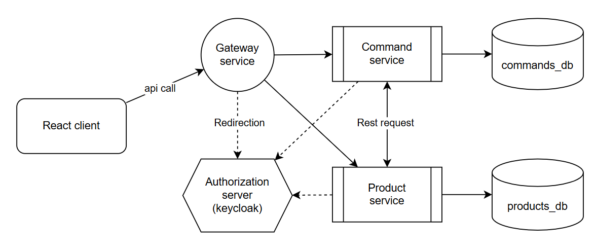
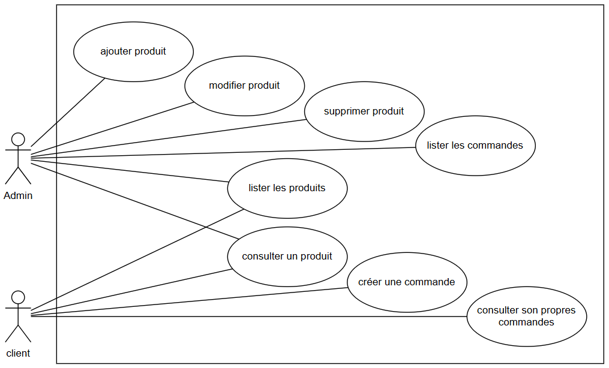
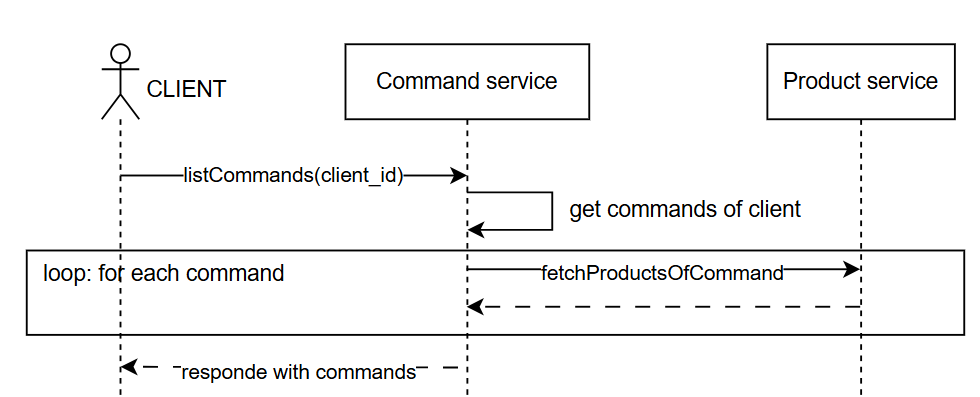
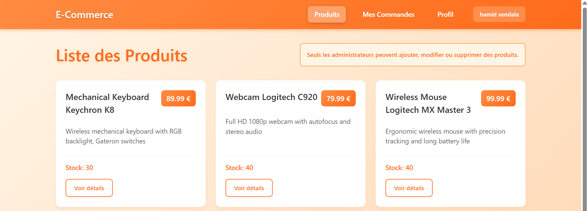
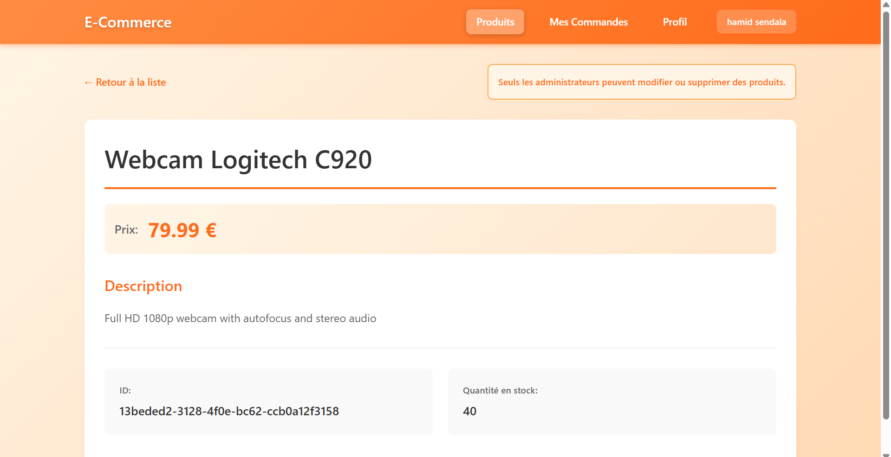
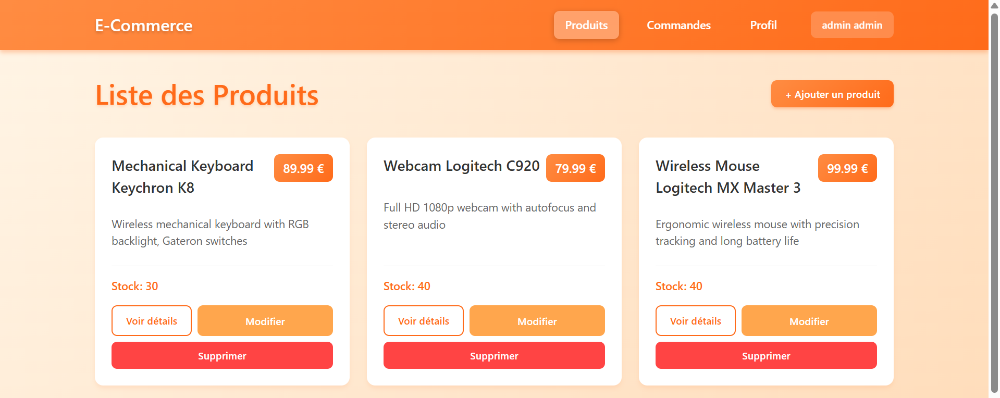
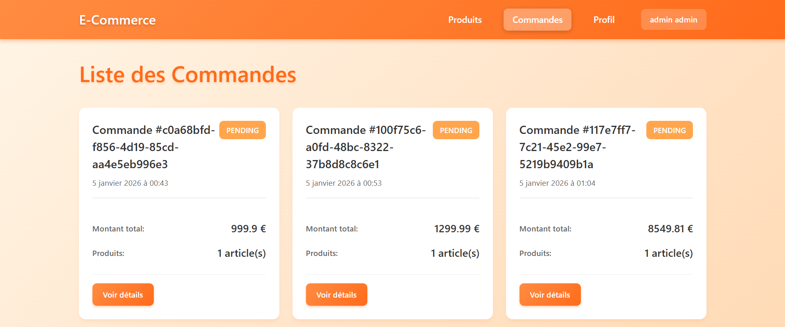
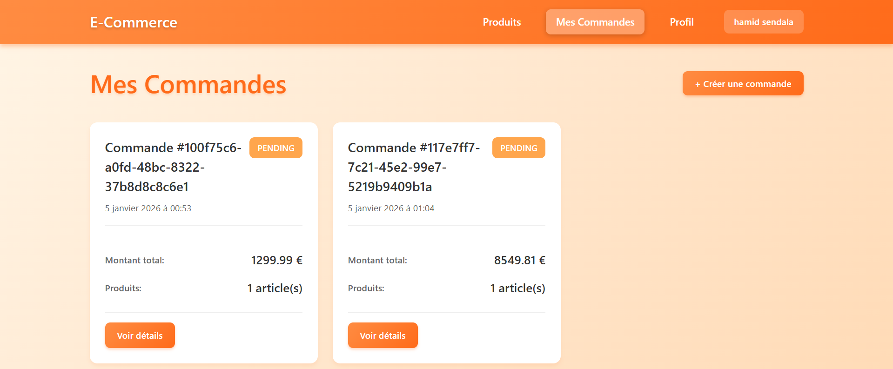
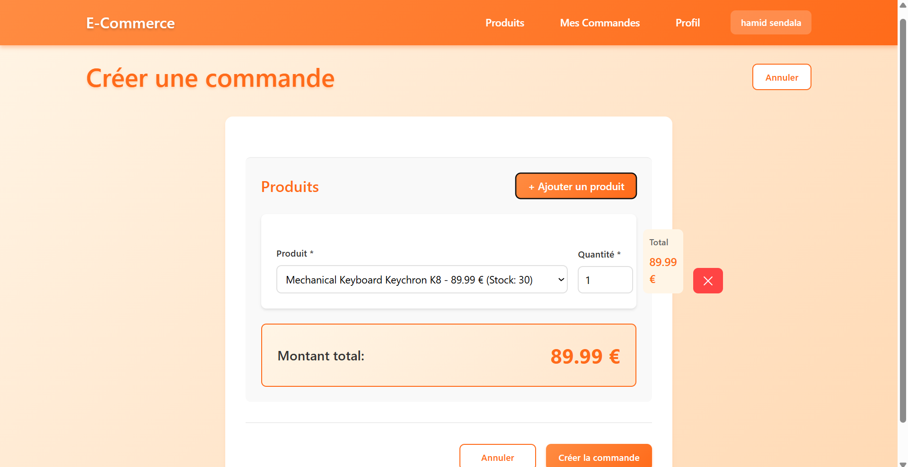
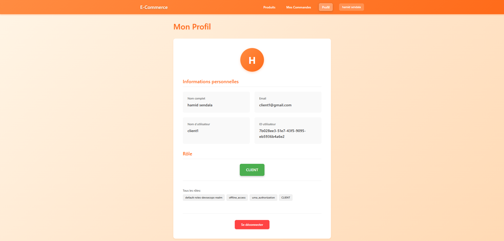

# Devops project

## Global architecture diagram



## Use case diagram



## Sequence diagrams

- We are mentioning only the sequence diagrams of commands.

### Create command (CLIENT)


### List commands of a client (CLIENT)



### List all commands (ADMIN)


## Dockerization

- To dockerize the microservices discovery-service, gateway-service, product-service and command-service:
  - we generate a jar file with `mvn package`.
  - Then we create a Dockerfile for each service to build image for each service from the jdk image.
```
FROM mosipdev/openjdk-21-jdk

LABEL authors="mouad"

VOLUME /temp

RUN apt-get update && apt-get install -y curl

COPY target/*.jar app.jar

ENTRYPOINT ["java", "-jar", "/app.jar"]
```
- example of a service in docker compose file (gateway service)
```yml
gateway-service:
  build: ./gateway-service
  container_name: gateway-service
  ports:
    - "8888:8888"
  expose:
    - "8888"
  environment:
    DISCOVERY_SERVICE_URL: http://discovery-service:8761/eureka
    JWK_URI: http://keycloak:8080/realms/devsecops-realm/protocol/openid-connect/certs
```

- Second we dockerize the front end by using node js and nginx image and some npm commands.
- And it was important here to create build variables that will be passed as args in docker compose.
```
# ---------- build stage ----------
FROM node:20-alpine AS build

WORKDIR /app

COPY package*.json ./
RUN npm install

COPY . .

ARG VITE_KEYCLOAK_URL
ENV VITE_KEYCLOAK_URL=$VITE_KEYCLOAK_URL

ARG VITE_API_URL
ENV VITE_API_URL=$VITE_API_URL

RUN npm run build


# ---------- runtime stage ----------
FROM nginx:alpine

# Remove default nginx config
RUN rm /etc/nginx/conf.d/default.conf

# Copy custom nginx config
COPY nginx.conf /etc/nginx/conf.d/default.conf

# Copy React build
COPY --from=build /app/dist /usr/share/nginx/html

EXPOSE 80

CMD ["nginx", "-g", "daemon off;"]
```
- a part of the front-end container in docker compose file
```yml
front-end:
  build:
    context: ./front-end
    args:
      VITE_KEYCLOAK_URL: http://localhost:8080
      VITE_API_URL: http://localhost:8888
  container_name: front-end
```

## Functionalities screenshots

- First we have **list products** and **see product details** which is accessible by CLIENT and ADMIN
- Second we have **add**, **modify** and **delete** product accessible only by the ADMIN

#### CLIENT
- list products



- see product details


#### ADMIN
- list, add, edit and delete product



- Then the ADMIN can **list all the commands** (the commands of all clients)
- But the CLIENT can **see his own commands** only and can **create new commands**

#### ADMIN
- list command



#### CLIENT

- list his own commands



- create new command



- Finally we have profile page where we can see the user role and he can logout

#### ADMIN & CLIENT
